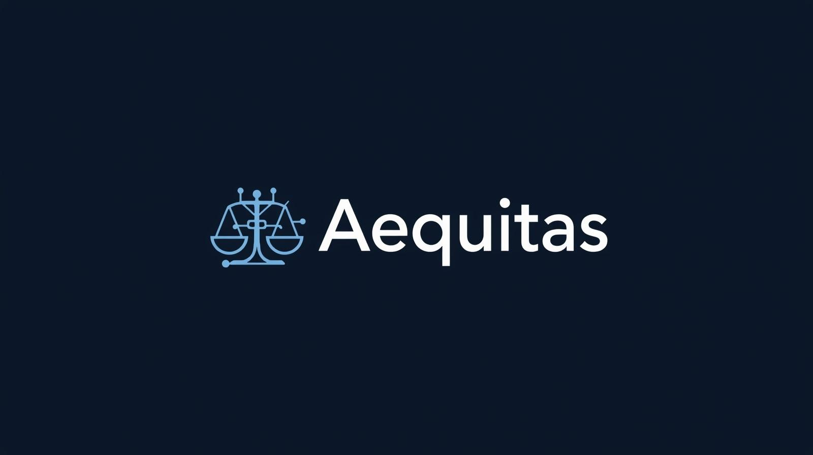

# Aequitas — Secure E-Voting Protocol




## Academic Information

**Project:** Aequitas — Secure E-Voting Protocol

**Course:** Algoritmi e Protocolli di Sicurezza

**Degree Program:** M.Sc. in Computer Science

**Institution:** Università degli Studi di Salerno

**Academic Year:** 2025–2026

**Authors:**
- Autorino Luigi
- Chirico Emanuel

---

## Overview

Aequitas is a cryptographic protocol for secure digital elections with nominal preference voting. The system implements end-to-end verifiable voting with minimal trust assumptions, enabling municipal-scale elections while preserving voter privacy, ensuring ballot integrity, and providing public verifiability of results.

The project is divided into four Work Packages:

| WP | Title | Content |
| --- | --- | --- |
| **WP1** | Threat Modeling & Architecture | Security properties, adversarial models, system actors |
| **WP2** | Protocol Specification | Setup, voting, tallying phases; RSA-OAEP, Shamir SSS, Merkle trees |
| **WP3** | Security Analysis | Threat resilience, parameter selection, residual risks |
| **WP4** | Implementation & Performance | Flask prototype, benchmarks, test suite |

---

## Key Properties

| Property | Description |
| --- | --- |
| **Minimal Trust** | Private election key never exists in one place: split via Shamir threshold secret sharing across N trustees |
| **End-to-End Verifiability** | Voters verify ballot inclusion via personal receipt; external observers validate the full tally cryptographically |
| **Voter Privacy** | Token-based authorization decoupled from preference encryption; temporal decorrelation via random delays |
| **Integrity** | Atomic ballot acceptance prevents double voting; publicly verifiable decryption prevents result manipulation |
| **Scalability** | Lightweight per-ballot validation at submission; heavy computation deferred to post-election tallying |

---

## Repository Structure

```text
Aequitas/
├── .env                        # Segreti locali (Google OAuth, admin token) — non versionato
├── requirements.txt
├── docs/                       # Papers (tutti i WP)
├── tests/
│   └── test_crypto.py          # Suite di test sui primitivi crittografici
└── src/
    ├── main.py                 # Entry point: init entità + avvio Flask
    ├── config.py               # Parametri globali di protocollo
    ├── crypto/
    │   ├── rsa_utils.py        # Generazione chiavi, OAEP, hash-and-sign
    │   ├── shamir.py           # Shamir Secret Sharing in Z_Q
    │   ├── merkle.py           # Merkle tree + prove di inclusione
    │   └── oaep_decode.py      # Decodifica manuale padding OAEP
    ├── entities/
    │   ├── electoral_auth.py   # ElectoralAuthority (E)
    │   ├── iap.py              # Identity & Authentication Provider (IAP)
    │   ├── vbr.py              # Verified Ballot Register (VBR)
    │   ├── trustee.py          # Trustee (T_i)
    │   ├── tally_machine.py    # TallyMachine (TM)
    │   └── voter.py            # VoterClient (lato client)
    └── web/
        ├── app.py              # Flask app factory + route handlers
        └── templates/          # Template Jinja2 (index, vote, receipt, results, …)
```

---

## Setup & Run

```bash
# Crea e attiva un virtualenv
python -m venv .venv
.venv\Scripts\activate          # Windows
# source .venv/bin/activate     # Linux / macOS

# Installa le dipendenze
pip install -r requirements.txt

# Configura le variabili d'ambiente
cp .env.example .env            # poi edita con le credenziali Google OAuth

# Avvia il server
python src/main.py
```

### Environment Variables (`.env`)

| Variable | Description |
| --- | --- |
| `GOOGLE_CLIENT_ID` | Client ID app Google OAuth |
| `GOOGLE_CLIENT_SECRET` | Client Secret app Google OAuth |
| `FLASK_SECRET_KEY` | Chiave per la firma dei cookie di sessione |

### Testing

```bash
pytest tests/
```

---

## Protocol Architecture

```text
Voter ──► IAP (authenticate) ──► Token
Voter ──► E   (get ballot)   ──► Encrypted ballot form
Voter ──► VBR (submit vote)  ──► Receipt + Merkle proof
              │
              └──► TallyMachine ──► Trustees (threshold decrypt) ──► Results
```

---

---

## Disclaimer

This project was developed for academic and educational purposes within the course *Algoritmi e Protocolli di Sicurezza* at the University of Salerno.

The implementation serves as a proof-of-concept prototype and has not undergone the extensive security review, formal verification, or operational testing required for deployment in real-world elections.

**Not intended for production use.**
